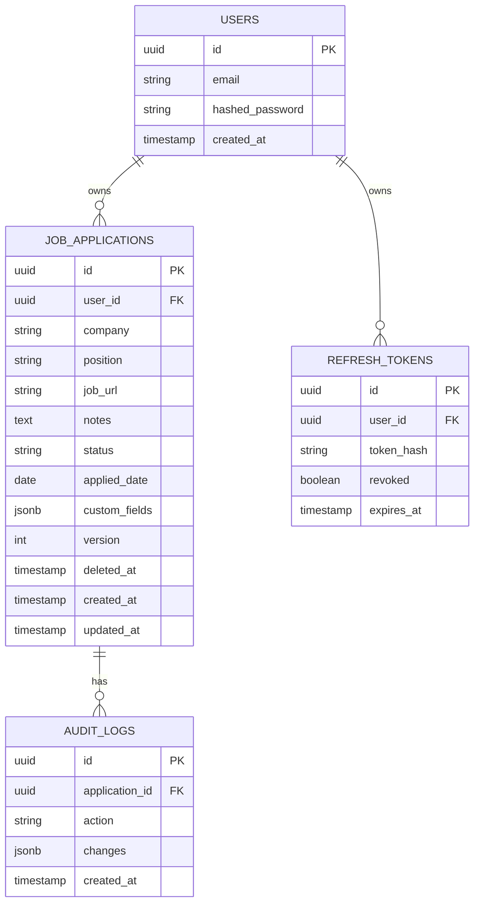

# JobTrack API

A backend API for tracking job applications, built to apply backend concepts (FastAPI, async SQLAlchemy, JWT auth, PostgreSQL).

The main thing I wanted to practice here was PostgreSQL's native full-text search, a proper soft delete + audit trail pattern, cursor-based pagination, and optimistic concurrency control — all in a simpler ownership-based app (no roles/hierarchy) so the focus stays on these concepts rather than repeating authorization logic.

## Tech Stack

- **Python** / **FastAPI**
- **PostgreSQL** with **SQLAlchemy 2.0** (native full-text search via `tsvector` + GIN index)
- **Alembic** for migrations
- **Pydantic v2** for validation
- **PyJWT** + **Passlib (bcrypt)** for authentication
- **slowapi** for rate limiting
- **pytest** + **pytest-asyncio** + **httpx** for testing

## Features

- JWT authentication with access + refresh tokens (rotation on refresh, revocation on logout)
- Ownership-based authorization — no roles, each user only ever sees and manages their own applications
- Full-text search over company, position, and notes using PostgreSQL `tsvector` (generated column) + GIN index — not `ILIKE`
- Soft delete with restore, backed by a full audit trail: every create, update, status change, delete, and restore is recorded
- Cursor-based pagination on both listing and search endpoints, ordered by `(created_at, id)` for a stable sort
- Optimistic concurrency control on updates via SQLAlchemy's `version_id_col` — two concurrent edits on the same application are detected, one gets rejected with `409 Conflict` instead of silently overwriting the other
- Free-form `custom_fields` (JSONB) per application, with basic validation (max 10 keys, primitive values only)
- Rate limiting on the login endpoint

## Entity-Relationship Diagram



## Ownership Model

There are no roles in this app. Every `JobApplication`, `AuditLog`, and `RefreshToken` belongs to exactly one user, and every query is scoped to the authenticated user's own data. Attempting to access another user's application returns `404 Not Found` rather than `403 Forbidden`, to avoid leaking whether a given resource exists.

## API Endpoints

| Method | Endpoint | Access |
|---|---|---|
| POST | `/auth/register` | Public |
| POST | `/auth/login` | Public |
| POST | `/auth/refresh` | Public |
| POST | `/auth/logout` | Public |
| POST | `/applications` | Authenticated |
| GET | `/applications` | Owner |
| GET | `/applications/search` | Owner |
| GET | `/applications/{id}` | Owner |
| PATCH | `/applications/{id}` | Owner |
| PATCH | `/applications/{id}/status` | Owner |
| DELETE | `/applications/{id}` | Owner |
| POST | `/applications/{id}/restore` | Owner |
| GET | `/applications/{id}/history` | Owner |

Full docs at `/docs` once running.

## Testing

```bash
# create a separate test database first (see .env.example for TEST_DATABASE_URL)
pytest -v
```

Covers auth (register/login/refresh/logout), CRUD + input validation, ownership isolation between users, soft delete/restore, status changes with their audit trail entries, one concurrency test for optimistic locking, full-text search, and cursor pagination across multiple pages.

## Known Limitations

- **Search relevance ranking:** results are ordered by recency (`created_at`), not by `ts_rank` relevance, to keep cursor pagination simple with a single stable sort key. Relevance-ranked search would need a composite cursor (rank + id).
- **`custom_fields` validation:** enforced only at the API layer (max 5 keys, primitive values). JSONB has no column-level constraints, so a direct database write could bypass these rules.
- **Audit log retention:** `audit_logs` has no archival or retention policy — it grows unbounded with usage.

## Getting Started

```bash
git clone https://github.com/MaximIoan0411/event-booking-api
cd job-track-api
python -m venv .venv
source .venv/bin/activate  # .venv\Scripts\activate on Windows
pip install -r requirements.txt -r requirements-dev.txt
cp .env.example .env  # fill in your values
alembic upgrade head
uvicorn app.main:app --reload
```

## License
MIT